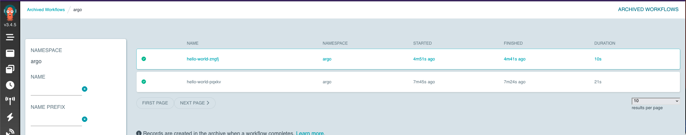

# workflow-archiving-test

# Pre-requisites
In order to run this locally, you will need [k3d](https://k3d.io/) installed, as well as kubectl and Helm.

You can replace k3d with something else and things will probably just work. Just sub out the `k3d` commands for whatever you want to use.

# Note: changes from the supplied values.yaml

Due to the redacted nature of the supplied values.yaml, I've had to make a few changes to get it to work:

- crds.install set to 'true' otherwise workflows won't work.
- sso block commented out as we don't have access to your SSO provider.
- Workflows ingress disabled
- artifactrepository block pointing at the internally-deployed minio instance.
- postgres pointing at the internally-deployed postgres instance.
- `workflowNamespaces` set to argo
- serviceMonitor.enabled set to false (to save us installing prometheus)
- add `workflow.rbac.create: true` otherwise nothing would deploy.
- set server to secure.true

I have kept your provided values at `argo-workflows/orig-values.yaml` so that you can diff between what you supplied and what I've changed.


### To create the cluster:

`k3d cluster create --config k3d.conf`

### Install minio and postgres:

```bash
kubectl create namespace minio && kubectl -n minio apply -f minio
kubectl create namespace postgres && kubectl -n postgres apply -f postgres
```
These are configured to automatically create appropriate buckets and databases.

### Apply the minio and postgres secrets to the argo namespace:
    
```bash
kubectl create namespace argo
kubectl apply -n argo -f workflows-additions
```

### Install Argo Workflows:

```bash
cd argo-workflows
helm dependency update
helm template -n argo  argo-workflows -f values.yaml . > todeploy.yaml
kubectl apply -n argo -f todeploy.yaml
```

`todeploy.yaml` can be viewed to see what is being deployed in the cluster.


### Check everything is running:

```bash
kubectl -n postgres rollout status deployment/postgres
kubectl -n argo rollout status deployment/argo-workflows-workflow-controller
kubectl -n argo rollout status deployment/argo-workflows-server
kubectl -n minio rollout status deployment/minio
```


### Run a workflow

```bash
kubectl -n argo create -f hello-world/hello-world.yaml
```

### Check the workflow has completed

You will probably want to wait a minute or so before running it. If it returns no values, the workflow hasn't completed yet.
```bash
kubectl get workflow -n argo -l workflows.argoproj.io/completed=true -o name
```

### Delete the workflow

```bash
kubectl get workflow -n argo -l workflows.argoproj.io/completed=true -o name | xargs kubectl delete -n argo
```

### Check for archivedworkflow.

Open the workflows UI in your browser (see below for port-forwarding instructions) and check the archived workflows tab.

`https://localhost:2746/archived-workflows`



## Additional checks
You can connect to the database to see the archiving. Minio is also available if you want to confirm log archiving.

# Delete the cluster
`k3d cluster delete workflow-archiving`


# Opening things in your browser
| Name           | Command                                                                                  | username   | password               |
|----------------|------------------------------------------------------------------------------------------|------------|------------------------|
| Argo Workflows | `kubectl -n argo port-forward --address 0.0.0.0 svc/argo-workflows-server 2746:2746`     | -          | -                      |
| Minio UI       | `kubectl -n minio port-forward --address 0.0.0.0 svc/minio 9000:9000`                    | `pipekit`  | `sup3rs3cr3tp4ssw0rd1` |


# Connecting to the Postgres DB
| Name           | Command                                                                    | username   | password               |
|----------------|----------------------------------------------------------------------------|------------|------------------------|
| Postgres       | `kubectl -n postgres port-forward --address 0.0.0.0 svc/postgres 5432:5432`| `postgres` | `sup3rs3cr3tp4ssw0rd1` |
